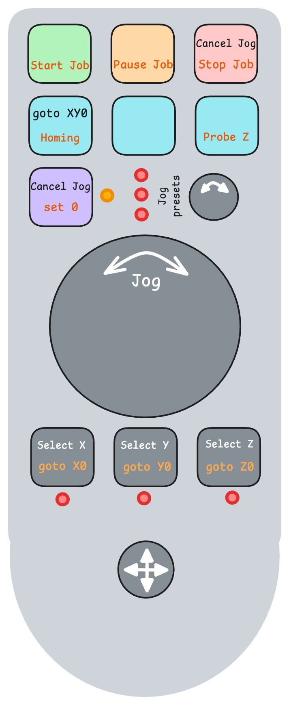
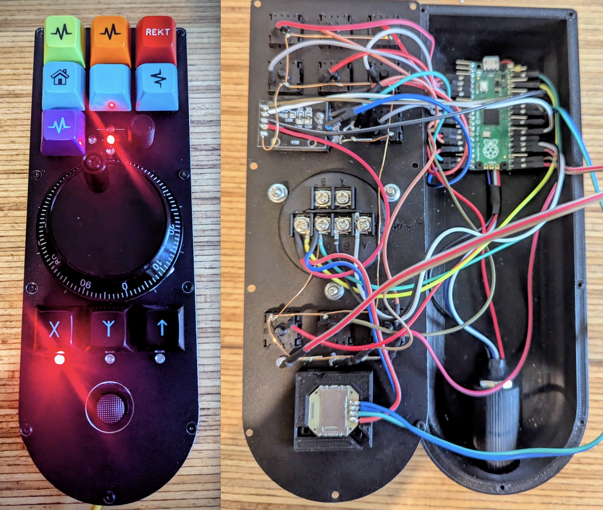

## gSender Remote

{height=500} {height=500}

Remote for gSender that acts as a Keyboard and a Joystick for the application. Could be used by any application that supports keyboard shortcuts and Joystick movements.

#### Parts :
- a RP2040 board (pi pico)
- a 100 step rotary encoder (for Jogging in X, Y or Z)
- a standard rotary encoder (for selecting the jog preset: precise, normal or rapid)
- a joystick from an old PSP
- 10 MX keys with keycaps - connected directly to the pico (no matrix)
- 7 led (axis selection X, Y or Z, jog preset selection: precise, normal or rapid, Zeroing mode) - connected directly to the pico (with 300 ohm resistors)
- an USB-c socket for host connection
- wires for connection (no time nor money to order a PCB, but cabling is long...)

The firmware is based on QMK, allowing very easily to transform key strokes, rotary movement and joystick movement into keyboard entries and Joystick events to the host OS.

Most keys have 2 actions possible:
- short press = action 1 (upper part of the legends, in black/white)
- long press = action 2 (bottom part of the legends, in red)
Dangerous actions (as stoping, probing, homing) are in long press with a long delay (>700ms right now).

