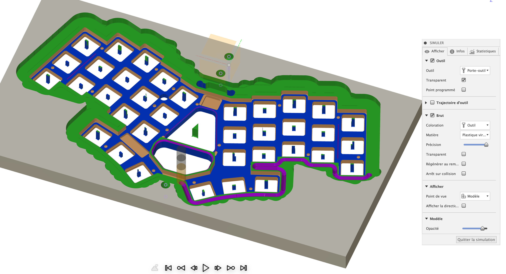
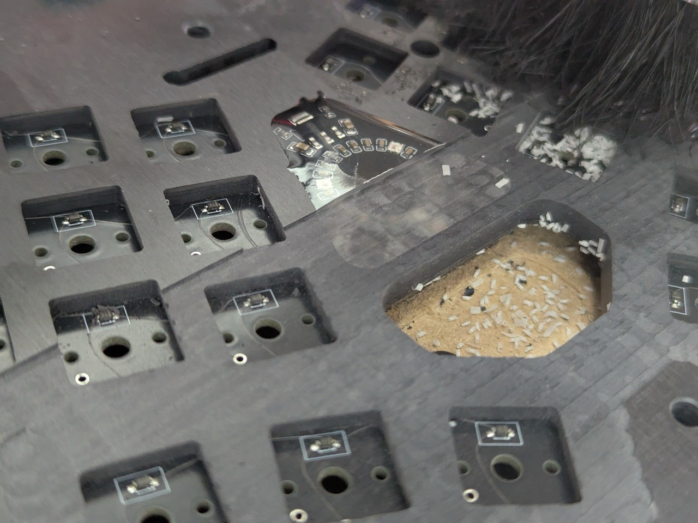

## unibody36tp

Clavier filaire custom 36 touches low-profile, layout proche de l'Ergo-L (https://ergol.org), avec intégration d'un trackpoint PS2 d'un thinkpad Lenovo.

**Spécifications:**
- **PCB custom** répondant à mon "cahier des charges"
    - CPU **RP2040**, pour sa compatibilité QMK...
        - Et pour ses PIOs bien utiles pour le PS2, les WS2812, ... (ça me fait plaisir de savoir que ce code tourne dans des zones optimisées, comme cela le RP2040 qui est déjà overkill pour QMK peut vraiment... ne pas faire grand chose).
        - Un peu plus compliqué au niveau PCB (mémoire, quartz) qu'un STM32, mais moins qu'un nRF!
    - Emplacement pour l'intégration d'un **Trackpoint** de récup Lenovo, au niveau de l'index droit (protocole PS2, géré dans QMK). J'adore la souris sous l'index, et le scroll génial et proportionnel...
    - Driver pour **retour haptique**
        - Petit composant DRV2605l de TI et un Linear actuator d'un tel portable (raccordé sur un bus I2C, driver existant dans QMK).
        - Le seul use case (mais bien utile!) concerne le feedback sur la désactivation de la layer "boutons de souris" (le clic principal redevient l'espace au bout d'1 seconde... mieux vaut le savoir)
    - **3 LEDs RVB** type WS2812. Peu utile, je ne regarde pas le clavier, mais ça fait joli un peu de couleur. J'ai une led rouge par ex sur l'activation de la dead-key Ergo-L, indiquant que la prochaine touche sera altérée! Idem pour la souris et qq layers avec d'autres couleurs... c'est le côté bling-bling.
    - **Layout à 36 touches**
        - en espacement MX parce que j'avais déjà tout calculé comme cela sur mon clavier précédent... 
        - mais connecteurs Chocs low-profile pour rester fin. A l'usage je trouve cela très bien, mais jamais testé un espacement choc! 
        - prévu pour soudure directe des switchs (des Kaihl Ambient Silent), de toute manière avec le module PS2 litéralement plaqué au PCB sous les touches, il faut que rien ne dépasse (_je coupe déjà les pins & le plastique des switchs à ce niveau_)
        - diodes "cachées" au niveau de l'espace des LEDs des switchs (_pas la meilleure idée du monde, il faut vérifier le fonctionnement des diodes avant de souder les switchs... mais bon, le test prend 2 minutes en flashant QMK et avec un trombone pour simuler le contact_)
    - **unibody**, parce que pour le transport, les réunions à droite à gauche, les splits c'est moins pratique!
    - Électronique disposée de manière "graphique" (en respectant quand même tous les pré-requis du processeur...)
    - Connecteur USB-C dans l'épaisseur du PCB, pour pouvoir le cacher dans le boîtier.
    - PCB identique mais sans pistes, pour servir de fond (mais qui sera usiné à la CNC sur les 2 faces pour en pas perdre en épaisseur).
    - Fabrication chez JLCPCB, avec usage de leur service d'assemblage PCBA (malheureusement en "standard", plus cher, à cause du connecteur USB et des RVB en format 2020... il y a un prix au perfectionnisme...). Env 200€ pour 10 PCB (transport et TVA compris), ça pique un peu...
  
- **Boîtier usiné dans la masse** à la CNC, sur base d'un bloc de Solid Surface noir
    - 6.6mm d'épaisseur fini, les PCBs sont encastrés par dessous, et les touches rapportées par dessous avant soudure (changement possible en dessoudant les 2 pins et en changeant le switch par dessus, bien sûr loin de la praticité d'un hot-swap)
    - fenêtre pour l'électronique et les LEDs (sera remplie pendant la construction d'epoxy liquide)
  
- **touches KLP Lamé** (https://github.com/braindefender/KLP-Lame-Keycaps) avec qq adaptations faites en 3D avant impression:
    - Espacement MX avec connecteurs Choc
    - Intégration du trackpoint sur les 4 touches de l'index droit
    - Motifs sur les pouces pour aider à détecter un décalage
    - Petite surépaisseur au niveau du connecteur Choc pour éviter le bruit de l'impact à ce niveau (et rester silencieux)
    - Impression chez JLC3DP (MJF / PA12-HP Nylon / Dyeing-Dyed Black), le rendu est juste génial, à la fois légèrement granuleux, mais bien lisse et d'un noir d'encre. Env. 20€ pour un set de touches, transport compris.
    - Adoptées en 15 minutes, les mains se placent maintenant automatiquement sur le clavier, c'est génial!
    
**Configuration QMK:**
- Configuration très inspirée de l'**Ergo-L** (https://ergol.org), avec quelques adpatations:
    - Layer "code" modifiée pour pouvoir récupérer la partie droite en touches de direction (principalement)
    - Layer "num" pour compenser l'absence d'une 4ième ligne, et aussi ajouter les symboles de la layer "code" perdus
- **Émulation complète** de l'Ergo-L au niveau QMK (l'OS reste en AZERTY), fonctionnant sur Windows et OSX/iOS, pour répondre à mes besoins spécifiques proféssionnels:
    - Pas de possibilité d'installer de driver sur mon PC d'entreprise
    - Pas de possibilité d'installer ni de configurer des OS "de production", divers et variés (en général des Linux, qq Windows aussi), dont l'accès se fait par des déports d'écran
    - Simplicité du "plug-and-play", j'arrive sur n'importe quel PC ou Mac, et mon clavier est en Ergo-L, sans aucune autre action.
    - Bien entendu, il y a des limites à cette approche "d'émulation" (en dehors du code qui est hideux), mais pas eu le moindre soucis depuis que j'ai débuté l'Ergol il y a plusieurs mois.
    - Dans mon petit header file "emul_azerty.h" je vais ajouter le support de Linux (iBus seulement) à titre expérimental, mais je n'ai pas besoin des caractères étendus de l'Ergo-L sur Linux, sur cet OS mon usage reste sur du shell d'administration :-)
    
**Roman Photo**
- PCB design et routage dans EasyEDA-Pro

  
- Modélisation dans Fusion 360

  
- Préparation de l'usinage dans Fusion (calcul du gCode de la trajectoire des fraises)

  
- Usinage du boîtier par dessous (CNC FoxAlien pilotée par gSender)

  
- Coulage de l'epoxy par dessus (note: faire une étanchéité parfaite!!! l'epoxy se faufile partout.... vraiment partout)

- Inspection du chat (étape cruciale!)

  
- Usinage par dessus (surfaçage de l'ensemble, mais aussi forme des touches, chanfrein)

  
- Polissage (papier de verre à l'eau, puis polish) - l'epoxy redevient transparent!

- Intégration du module PS2

- Clavier fini

**Inspiration et remerciements :**
- La disposition Ergo-L. Une révélation. Je ne suis toujours pas aussi rapide qu'en Azerty après 6 mois (pas sûr que je le sois un jour, mon cerveau est câblé Azerty après 40 ans d'usage), mais maintenant utiliser le clavier est un *plaisir*. Et ça c'est irremplaçable, ça vaut plus que la vitesse!!!
- Pour l'intégration PS2, j'ai suivi le beau projet d'un clavier split sous ZMK: https://github.com/infused-kim/kb_zmk_ps2_mouse_trackpoint_driver
- La classe et la simplicité du clavier de TeXitoi (magnifique!): https://github.com/TeXitoi/keymini.

**Après 6 mois**
- Toujours mon clavier principal pour travailler, tous les jours :-)
- À l’usage, petit conflit avec l’activation de la layer « num » (en violet) et avec la layer automatique de la souris (par ex sous Excel, après un déplacement de souris et sélection d’une cellule, la layer souris reste active pour 1 seconde… et bloque la saisie immédiate de texte)
- Quelques enchaînements pas très pratique (chiffres dans des majuscules par ex), mais rien de trop pénalisant
- Je teste depuis ce jour une réorganisation de la layer « CODE » (en vert) avec le numpad sur la droite (et avec déplacement de toutes les touches de direction dans une layer « DIR » qui remplace la layer « NUM ». N’étant pas sûr de ma préférence, j’ai fait une keymap différente « ergol2 » pour cela:

À voir si cela corrige les petits soucis !